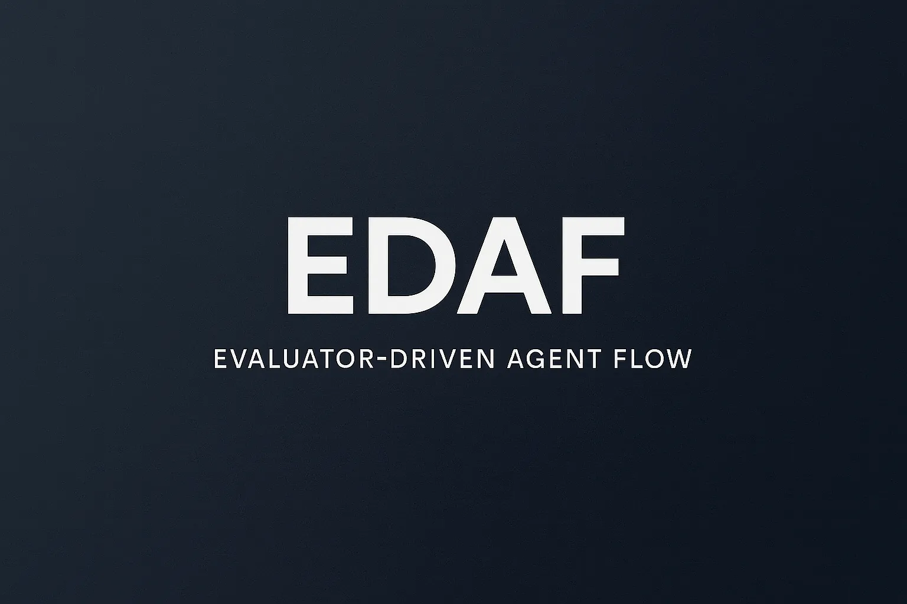
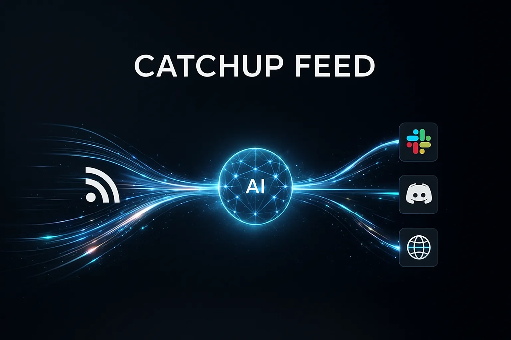
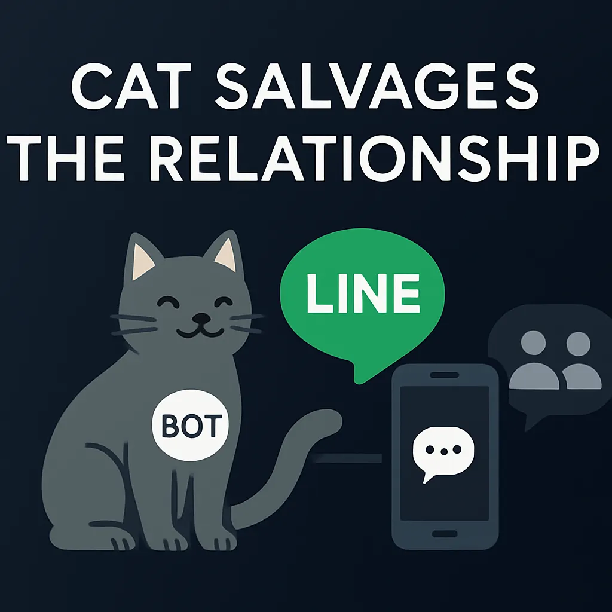

# Hi there 👋
**Rails Engineer / AI-Driven Development Enthusiast**

## 🎯 Current Focus
- Claude Codeを活用したAI駆動開発の探求
- Go + Clean Architectureでのバックエンド設計
- LLMを組み込んだ開発ワークフローの効率化

## 🛠 Tech Stack

**Main**

**Exploring**

## 🔥 Featured Projects

### [EDAF - Evaluator-Driven Agent Flow](https://github.com/Tsuchiya2/evaluator-driven-agent-flow)

Claude Codeのサブエージェントを活用した**評価者駆動型開発フレームワーク**。タスクの自動評価・改善サイクルを実装し、32個のエージェントが協調動作。Rails 6.1→8.1アップグレードを約1.5時間で完了。

📝 [EDAFの解説記事（Qiita）](https://qiita.com/Tsuchiya2/items/013a467c07286c6732f5)

### [catchup-feed-backend](https://github.com/Tsuchiya2/catchup-feed-backend)

Go + Clean Architectureで構築した技術記事RSS管理ツール。並行処理による高速フィード取得を実現し、AIで翻訳・要約してSlack・Discordへ配信。[フロントエンド](https://github.com/Tsuchiya2/catchup-feed-front)（Next.js + TypeScript）は[デプロイ済み](https://pulse.catchup-feed.com/)。

## 📦 Other Projects

### [cat_salvages_the_relationship](https://github.com/Tsuchiya2/cat_salvages_the_relationship)

コロナ禍で連絡が途切れがちな関係性を維持するためのLINE Bot。グループに交流のきっかけを自動配信。

`Ruby on Rails 8` `LINE Messaging API`

## 🔗 Links

