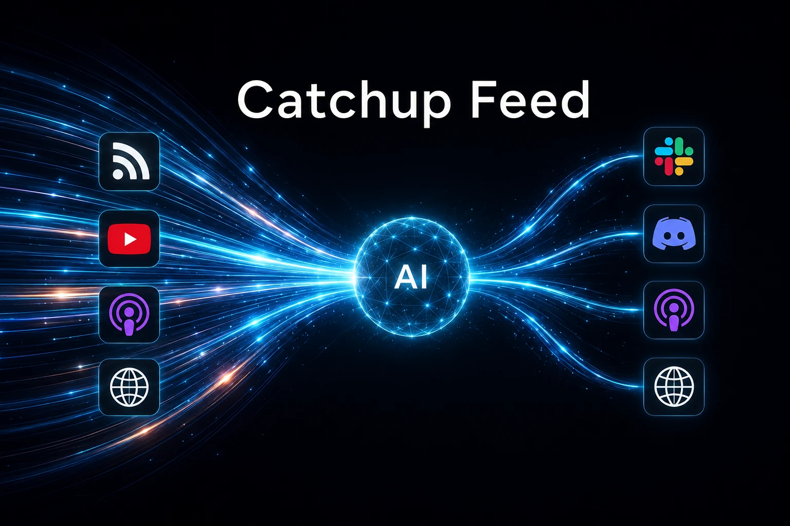
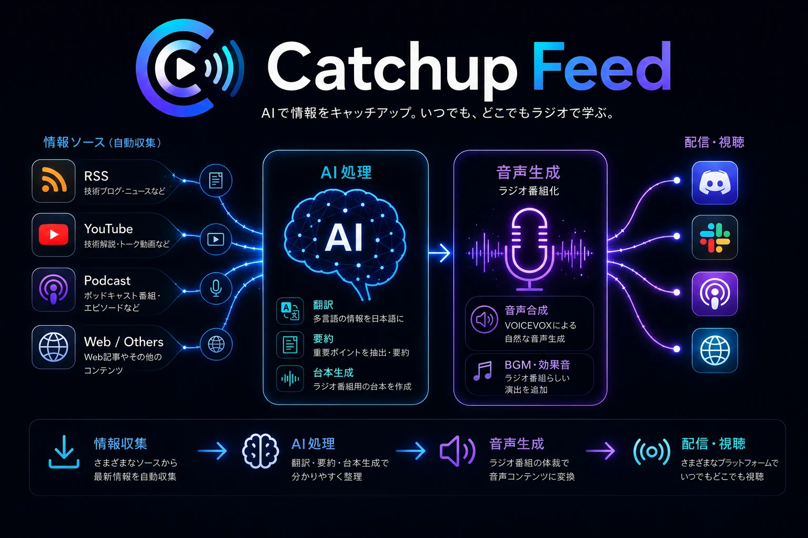
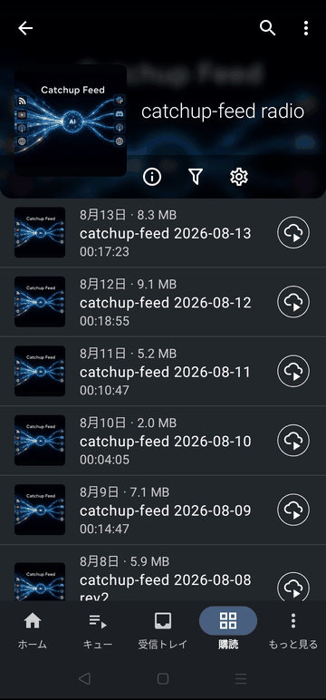
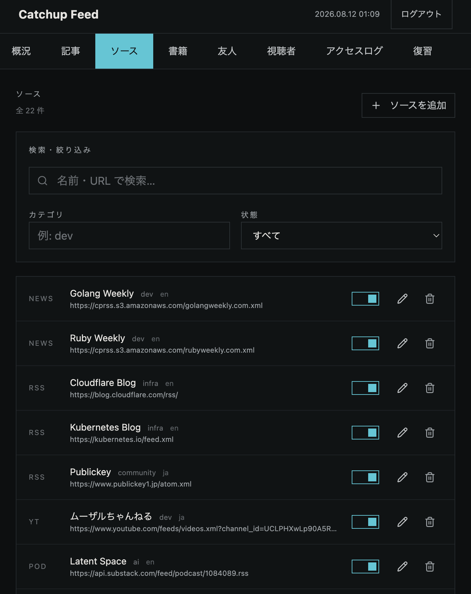
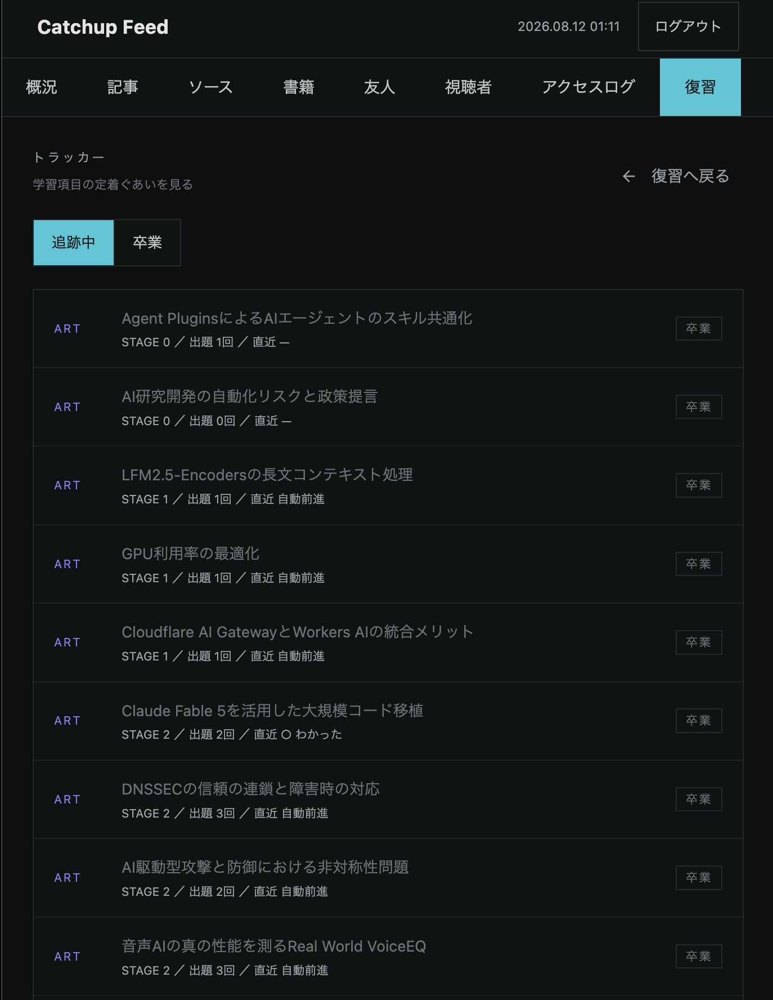
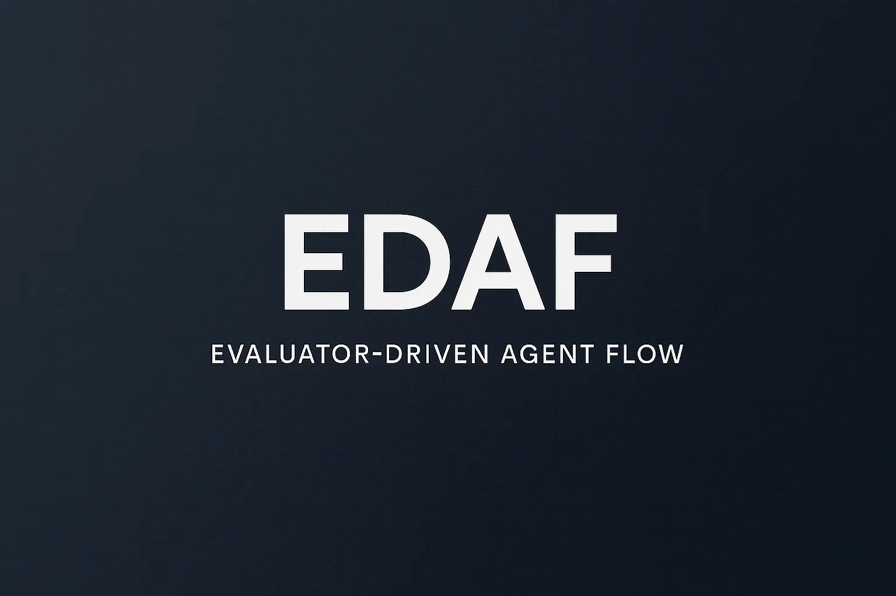
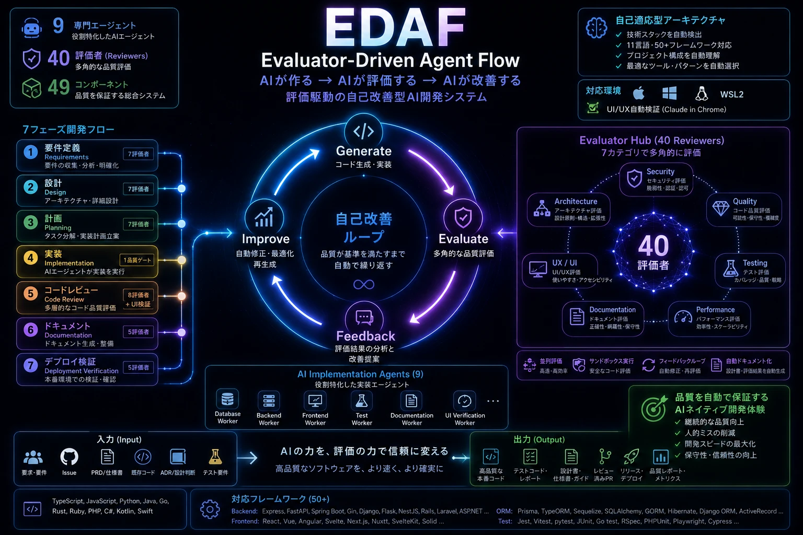
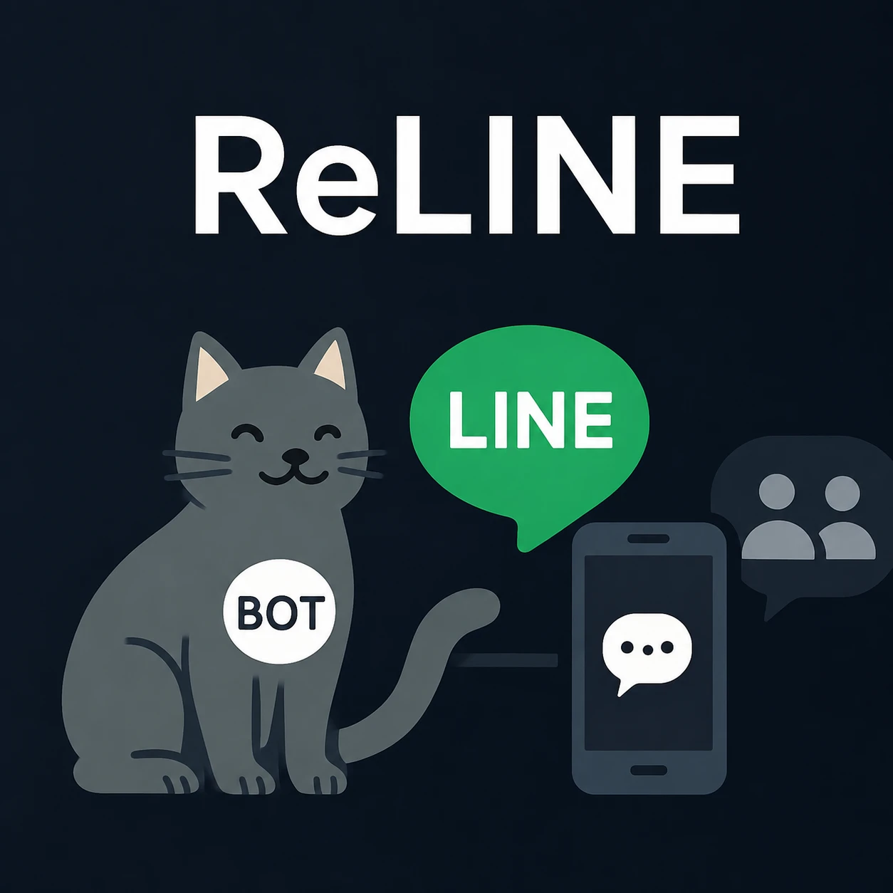
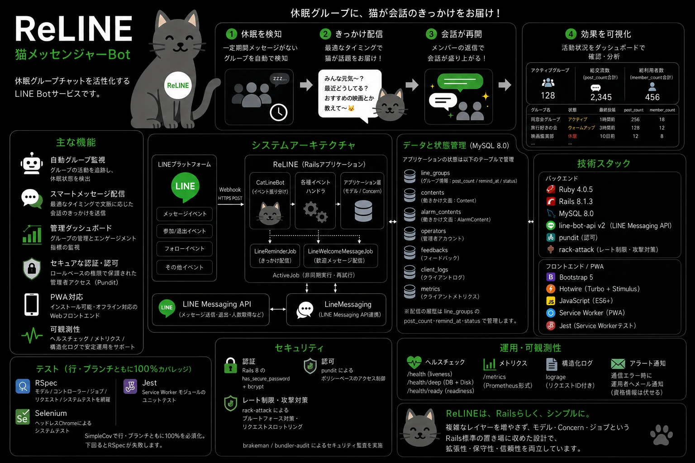

# Tsuchiya Yuji

**Backend Engineer | Ruby on Rails / Go | AI-Driven Development**

## About Me

Ruby on Rails を軸にしたバックエンドエンジニアです。本業で Rails バックエンド開発(5年目)、副業では10年以上稼働のレガシー Rails(Ruby 2.4 / Rails 5.1 → 4.0 / 8.1)のモダン化を主担当しています。以下の Featured Projects は個人開発です。

## Tech Stack

**Backend**

**Frontend**

**Infrastructure / DevOps**

**AI / LLM**

---

## Featured Projects

### 1. [Catchup Feed](https://github.com/Tsuchiya2/catchup-feed-backend)

**技術情報を毎朝10〜15分のラジオ番組に自動変換して届けるパーソナルポッドキャストシステム(実稼働中)**

RSS・YouTube・ポッドキャストから技術情報を自動収集し、LLMで要約 → 台本生成 → VOICEVOXで音声合成した番組を、毎朝ポッドキャストアプリに配信するシステム。初代(RSS要約のSlack/Discord配信ツール)の運用で「配信された記事数を最適化しても理解は定着しない」ことを確認し、最適化目標を**理解の定着**に再定義して作り直しました。育児等で手と目が塞がる細切れ時間でも耳から消化できる形です。クイズ生成とspaced repetitionによる学習ループも音声に注入しています。

| 項目 | 内容 |
|------|------|
| **バックエンド** | Go 1.26(単一モジュール、server / worker / radio の3バイナリ構成) |
| **フロントエンド** | Next.js 16 + TypeScript (Strict) + TanStack Query(PWAダッシュボード) |
| **AI / 音声** | 要約: Gemini → Groq → Ollama フォールバック連鎖 / TTS: VOICEVOX / 文字起こし: faster-whisper |
| **インフラ** | Raspberry Pi 5 + M3 Mac(夜間バッチ)+ Cloudflare Tunnel + Tailscale + Vercel |
| **ダッシュボード** | [pulse.catchup-feed.com](https://pulse.catchup-feed.com)(要ログイン) |

**システム全体像:**

RSS / YouTube / ポッドキャスト等から収集した情報を、要約・台本生成を経てラジオ番組に変換し配信するまでの流れ:

**画面イメージ:**

毎朝生成された番組が、購読中のポッドキャストアプリに自動で届きます(手と目が塞がる時間でも耳だけで消化できる形):

| ソース管理(RSS / YouTube / Podcast) | 学習トラッカー(spaced repetition) |
|---|---|
|  |  |

**技術的なポイント:**

*アーキテクチャ:*
- 単一ユーザーに右サイズした設計(初代のマイクロサービス・gRPC・Prometheus を「要件に対して過剰」と判断して撤去し、約3.8万行を削減)
- 縮退許容設計 — 「壊れない」より「壊れても翌日勝手に戻る」(Mac不在→エピソード欠番、無料API全滅→ローカルLLM、TTS障害→当日スキップ)
- 固定費ゼロ運用 — LLMは無料枠→ローカルのフォールバック、ホスティングは自宅Pi 5 + Cloudflare Tunnel
- プライバシー分界 — クラウドAPIに流すのは公開記事のみ、書籍・私的データはローカルLLM(Ollama)に限定
- 設計判断は決定ログ(D-xx / C-xx)として記録しながら開発

*バックエンド:*
- RSS / YouTube / ポッドキャストのマルチモーダル取り込み + 書籍PDFのRAG取り込み(Python + pgvector)
- 理解定着の学習ループ — 放送記事からクイズを自動生成し、spaced repetition(3段ラダー)で復習を翌朝の番組に注入
- トークン認証付きプライベートRSS配信(友人への限定配信、平文トークン非保存・404統一応答)
- セキュリティ実装 — HttpOnly Cookie JWT・SSRF防御・XFF詐称対策のレート制限

*フロントエンド:*
- OpenAPI仕様からの型自動生成によるEnd-to-End型安全性
- ソース管理・友人/トークン管理・アクセスログ・学習トラッカーのPWAダッシュボード

*開発プロセス:*
- Claude Codeのマルチエージェントオーケストレーション(親がタスク分解・裁定、実装エージェントとレビューエージェントを分離)で開発

📦 [フロントエンド リポジトリ](https://github.com/Tsuchiya2/catchup-feed-frontend)
📦 [AI リポジトリ(文字起こし・書籍RAG)](https://github.com/Tsuchiya2/catchup-feed-ai)

---

### 2. [EDAF - Evaluator-Driven Agent Flow](https://github.com/Tsuchiya2/evaluator-driven-agent-flow)

**AIコード生成の品質を自動評価・保証する7フェーズ開発フレームワーク**

Claude Codeのサブエージェント機能を活用し、**9つの専門エージェント + 40の評価者**による多層的な品質ゲートを実装。AIが生成したコードを自動的に評価・改善するサイクルを構築しました。

| 項目 | 内容 |
|------|------|
| **技術** | Claude Code Subagent, Prompt Engineering |
| **特徴** | 7フェーズ品質ゲート、自己適応型アーキテクチャ(技術スタック自動検出) |
| **対応** | 11言語、50+フレームワーク |

**技術的なポイント:**
- 並列評価によるパフォーマンス最適化
- サンドボックス実行による安全なコード評価
- フィードバックループによる自動修正・再評価
- 各フェーズの設計書・評価結果を自動でドキュメント化し、人間が最終判断できる状態を維持

📝 [EDAFの解説記事(Qiita)](https://qiita.com/Tsuchiya2/items/013a467c07286c6732f5)
※解説記事は2025年12月時点の構成(5フェーズ・32エージェント)。現在は7フェーズ・49コンポーネントに拡張

---

### 3. [ReLINE - 猫メッセンジャーBot](https://github.com/Tsuchiya2/cat_salvages_the_relationship)

**休眠グループチャットを活性化するLINE Bot**

コロナ禍で連絡が途切れがちなグループに、かわいい猫のマスコットが会話のきっかけを自動配信。LINE Messaging APIを活用したイベント駆動アーキテクチャで実装しました。

| 項目 | 内容 |
|------|------|
| **技術** | Ruby 4.0.5 + Rails 8.1.3 + MySQL 8.0 |
| **連携** | LINE Messaging API |
| **テスト** | RSpec + Selenium(100%カバレッジ) |
| **フロント** | Hotwire (Turbo + Stimulus) + Bootstrap 5 |

**技術的なポイント:**
- サービスオブジェクトによる責務分離(Fat Model/Controller回避)
- ストラテジーパターンによる動的イベントハンドラー選択
- Rack::Attackによるレート制限・ブルートフォース対策
- Brakeman・bundler-auditによるセキュリティ監査

---

## Links

